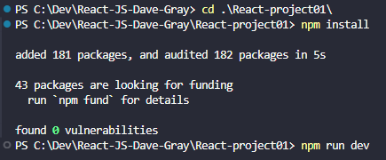

# React-JS-Dave-Gray

free 9 hour React course by Dave Gray - https://youtu.be/RVFAyFWO4go

Many **Frontend frameworks** exist, but React JS stands out as the most in-demand choice and as the library that has dominated the industry over the last decade.

This React course is a pre-requisite for following chapters 12 to 17 in Dave Gray's TypeScript course:  
https://courses.davegray.codes/view/courses/web-dev-roadmap-for-beginners/1702900-industry-tools/5527326-typescript

Of course, to follow this React course, you need to understand HTML, CSS and JavaScript (JS).  

>[!Note]
>This follow-up video for React Router version 6 provides an update for the blog project in the original course video:   
>https://youtu.be/XBRLVRjZ3CQ

---

# Chapter 1

>[!important]
>Create React App (CRA) has been deprecated and is no longer recommended for starting new React projects.  
>The React team removed CRA from the official documentation in early 2023.  
>Recommended alternatives include Vite, Next.js, Remix, or Gatsby.


React is a open-source front-end JS library for building User Interfaces (UIs) or UI components.  
Its initial release was in May 2013, and it was developed by Facebook and the dev community.  

website = https://react.dev/  

To get started with React, we need to make sure we installed Node.js.  
- check currently installed version: `node -v`  
- install on Arch Linux: `sudo pacman -S nodejs`

It might be useful to also install the React Dev Tools for your favorite Web browser.  

Let's create our first React project: 
- open a terminal window in VS code
- `npm create vite@latest`  
- name your project, select React (framework), and TypeScript (variant)
- `cd` into your project directory
- run `npm install` to install missing dependencies
- run `npm run dev` to start your dev server
- ctrl + click on the provided URL (http://localhost:5173/)

Now we can go to the Extensions tab in VS Code (ctrl + shift + X) and install the ES7+ extension.  
The exact name is **ES7+ React/Redux/React-Native snippets**.

**Additional tip**:
- open VS Code settings via ctrl + ,
- search for 'Emmet'
- find 'Emmet: include languages'
- to use Emmet abbreviations for React, add 'javascript' (key) and 'javascriptreact' (value).

---

**IMPORTANT**:
Every time we clone a React project from GitHub, we need to run `npm install` to install the dependencies.  
Then we can run `npm run dev` to start our dev server.  
Before running `npm install`, we need to `cd` into the project folder.


---

## The node_modules folder

The **node_modules** folder is a directory in **Node.js** projects that stores third-party libraries and dependencies.  
It serves as a cache for external modules that a project depends on (**dependencies**).  
When you use **npm** (Node Package Manager) to install packages, they are downloaded and stored in this folder.  

Since you don't want to store all of those files in your repository, the node_modules folder is included in the  
**.gitignore** file. That's why this folder is greyed out in VS Code file tree.

---

## How React works

React uses only one .html file. This file loads into the browser and then React takes over and presents the rest of the content.  
The `package.json` file includes the project name, the version, some default scripts, the list of **dependencies**.  

The list of **dependencies** is important because this is how Node knows which depedencies to pull in from the **node_modules** folder.  

---

# Chapter 2 - App & JSX

We will explore the App component, which is the default component created in any new React project.  
we'll also explain what is JSX, and what we can do with it.  

---

>[!important]
>Web pages are not able to render .tsx code directly without compiling to JavaScript.    
>Websites that appear to run .tsx directly are actually using a build process that compiles   
>the TypeScript and JSX into JavaScript, and then the compiled JavaScript is executed.

---

## The 'src' folder

Let's look at our `main.tsx` file (in the past, we used to have an `index.js` file instead).  
In this file, we import our app via `import App from './App.tsx'` (line 4).  

```tsx
import { StrictMode } from 'react'
import { createRoot } from 'react-dom/client'
import './index.css'
import App from './App.tsx'

createRoot(document.getElementById('root')!).render(
  <StrictMode>
    <App />
  </StrictMode>,
)
```  

In React, **each component gets its own file**.  
And at line 8, you can see that the **App** component is injected into the **DOM**.  
And it's injected into the element that has the id of '**root**', which is the default when you create a React project.  

---

Now, let's look at this `App.tsx` file (replaces the formerly used `App.js` file).  
You'll notice that the App component is a function. Modern React uses functional components.  
But you may see some legacy code with Class components.  

## JSX

The `return` statement in the `App()` function of our `App.tsx` file returns JSX.  
**JSX**, or **JavaScript XML**, is a syntax extension for JavaScript that allows developers to write **HTML-like code**  
within JavaScript.  

Initially created by Facebook for use with the React framework, JSX has become widely adopted across various web development frameworks.  

JSX allows us to put JavaScript expressions in the code.  
For example, we can use **variables** as the value of an image source .  
These variables need to be **imported** at the top of our `App.tsx` file, or declared inside the `App()` function.  
The **curly braces** say "hey, that's a JavaScript expression, not HTML".  

Note that **objects** or **booleans** cannot be rendered to the page via JS expressions.  

To **comment** out a line of JSX code, use `{/* your code here */}`.  

**Practical example**: lines 5 to 9 + line 20 of the `Content.tsx` file.  
We will be using a function to render a randomly generated name.  
`Content.tsx` will be created in the next chapter.

---

# Chapter 3 - Functional Components

>[!note]
>Since React 17, importing React is no longer required for functional components in most cases.

---

Today, we'll be adding functional components to our project.  
Because that is some of the power of React, we can create components that are **reusable**.  

For that end, we'll use the VS Code extension named **ES7+ React/Redux/React-Native snippets**.  

In our `main.tsx` file, we import the `App` component from the `App.tsx` file.

The **App** component (`App.tsx`) is the default component created in any new React project.  
It's also the **parent** of all the other components in the **component tree**.  

And these other components that we will create will also need to be **imported** into the `App.tsx` file.  

## Our first child component

Let's create a `Header.tsx` file in our `src` folder.  
Use **ctrl + alt + R** to seach a React snippet, and type '**rafce**' to get the React Arrow Function Component.  
This will automatically create a function named after the file name (Header in our case).  

We can remove the `import React` statement (non longer needed since React 17).  
Current React version is 19 (2025).  

Note that we're not bound to use <div>, it's very easy to get caught up just using divs when using React.  
But it's best to stick with the semantic HTML tags.  

Once we've created our Header component, we need to import it into the `App.tsx` file.  
`import Header from './Header.tsx'`  

And then we can use Header in the return statement of our `App()` function to make it appear on the web page.  
```tsx
function App() {
  return (
    <>
      <div>
        <Header />  {/* this component is imported from Header.tsx */}
      </div>
```

## Our second child component

Same steps as before:
- Let's create a new file named `Content.tsx` in our `src` folder.  
- Then press **ctrl + alt + R** and type '**rafce**' to get the React Arrow Function Component.  
- remove the `import React` statement
- Replace the <div> tag with a <main> tag.  
- import the `Content` component into the `App.tsx` file
- apply this new component to the return statement of the `App()` function

```tsx
function App() {
  return (
    <>
      <div>
        <Header />  {/* this component is imported from Header.tsx */}
        <Content />
      </div>
```

## One more component

This will be `Footer.tsx`.
- press ctrl + alt + R then type 'rafce'
- remove the `import React` statement

---

# Chapter 4 - Applying CSS styles

How to apply CSS styles to React components?  

You can see that we import an `App.css` file at the top of our `App.tsx` file.  
Similarly, we import an `index.css` file at the top of our `main.tsx` file.  

It's very common to create one stylesheet (.css file) for each component file.  
However, that's not necessary in a small project, where one single stylesheet will do.  

You can also **inline** the styles inside the JSX code.  
**Example** of that: line 3 of the `Header.tsx` file. 

```tsx
const Header = () => {
  return (
    <header style={{
      backgroundColor: 'royalblue',
      color: '#fff'
    }}>  
      <h1>Groceries List</h1>
    </header>
  )
}
```

The "double curlies" syntax is commonly used for passing objects in JSX, such as style objects.  
The outer curly braces { } indicate a JavaScript expression in JSX, while the inner curly braces { }  
define an object literal for the inline style.  

>[!important]
>If you use one stylesheet per component, remember that every stylesheet needs to be imported in the  
>component file where you want to use it.  

---

# Chapter 5 - Click Events

React is a JS library. So just like in vanilla JS, it can respond to many different event types.  
In this chapter, we'll learn how to add click events to our React components.  

In React, we can use **event handlers** to handle user interactions.  
Let's do that in our `Content.tsx` component.  

For a better development experience (**DX**), we can install the React Dev Tools browser extension:  
https://reactjs.org/link/react-devtools  


## Basic click event example

We first add a `handleClick` function to our Content component, before the return statement:
```tsx
const Content = () => {
  const handleClick = () => {
    console.log('I was clicked');
  }
```

Then, we add the following code to the return statement:
```tsx
<button onClick={handleClick}>I</button> 
```

Open the console (Ctrl+Shift+K on Firefox) and click the button to see the message.  

---

### Function call vs Function reference (side note)

In the following code, we can see the difference between a function call and a function reference.
  - Without parentheses: Pass the function as a reference (for event handlers).
  - With parentheses: Immediately call the function and use its result.

```tsx
const Content = () => {
  const handleNameChange = () => {
    const names = ['Bob', 'Kevin', 'Dave'];
    const int = Math.floor(Math.random() * 3); // 0,1,2
    return names[int];
  }

  const handleClick = () => {
    console.log('I was clicked');
  }

  return (
    <main>
      <button onClick={handleClick}>I</button>  {/* this is a function reference */}
      <p>Hello {handleNameChange()}!</p>  {/* this is a function call */}
    </main>
  )
}
```

---

## Passing data to event handlers

What if we wanted to pass in an argument to our `handleClick` function?  

You can't directly call the function in the JSX code `onClick={handleClick2('Dave')}`,  
because it would immediately execute the function when the component renders, rather than waiting for the click event.  
We need to use an **anonymous function** to pass in the argument.  

Let's write a second function that takes in a string argument:
```tsx
const Content = () => {
  const handleClick = () => {
    console.log('I was clicked');
  }

  const handleClick2 = (name: string) => {
    console.log(`${name} was clicked`);
  }

  return (
    <main>
      <button onClick={handleClick}>I</button>  {/* function reference */}
      <button onClick={() => handleClick2('Dave')}>Dave</button>  
    </main>
  )
}
```

*Note 1:*
We don't need inner curly braces around `handleClick2('Dave')` because it's a single-line function.  
**For single-line arrow functions, the curly braces and the 'return' keyword can be omitted**.  

If you were to add curly braces, you would need to explicitly use the 'return' keyword like this:  
```tsx
<button onClick={() => { return handleClick2('Dave'); }}>Dave</button>
```

*Note 2:*
In the first example, the `handleClick` function is referenced, which means it isn't called until we click the button.  
In the second example, the anonymous function `() =>` is called when we click the button, which in turn calls the `handleClick2` function.  

---

Let's have one more example.  
We're going to pass the event object as an argument to a `handleClick3()` function:  

```tsx
const Content = () => {
  const handleClick = () => {
    console.log('I was clicked');
  }

  const handleClick2 = (name: string) => {
    console.log(`${name} was clicked`);
  }

  const handleClick3 = (e: React.MouseEvent<HTMLButtonElement>) => {
    console.log((e.target as HTMLButtonElement).innerText); 
  }

  return (
    <main>
      <button onClick={handleClick}>I</button>  {/* function reference */}
      <button onClick={() => handleClick2('Dave')}>Dave</button>  
      <button onClick={(e) => handleClick3(e)}>Click me</button>
    </main>
  )
}
```

**IMPORTANT**:  
We had to use **type assertion** in `console.log((e.target as HTMLButtonElement).innerText);`  
because TypeScript doesn't know that e.target is specifically an HTMLButtonElement.  

We could also have used a **type guard** to check if the target is an HTMLButtonElement:  
```tsx
const handleClick3 = (e: React.MouseEvent<HTMLButtonElement>) => {
  if (e.target instanceof HTMLButtonElement) {
    console.log(e.target.innerText);
  }
}
```

Obviously, React can listen for many different events: onDoubleClick, onMouseOver, onMouseOut, etc.

---

# Chapter 6 - useState Hook

React Hooks are **functions** that allow functional components to access and use React features.  
React actually was so named because it **reacts to changes** in the **state** of the **components**.  
And when there are changes, then it re-renders the component without reloading the whole webpage.  

We will work on our `Content.tsx` component.  

At the top of the file, we need to import the `useState` hook:
```tsx
import { useState } from 'react'
```  

And we will work on improving our `handleNameChange` function:
```tsx
const Content = () => {
  const [name, setName] = useState<string>('Dave');
```

The first value '**name**' will provide the current state at any given point in time.  
The second value '**setName**' is a function that allows us to update the state.  
They almost work like a getter and a setter.  

Now we can replace our handleNameChange function in the JSX code (inside the return statement):  
```tsx
<p>Hello {handleNameChange()}!</p>
```

with:
```tsx
<p>Hello {name}!</p>
```

We also need to change our `handleNameChange` function:
```tsx
const handleNameChange = () => {
  const names = ['Bob', 'Kevin', 'Dave'];
  const int = Math.floor(Math.random() * 3); // 0,1,2
  return names[int];
}
```

becomes:
```tsx
const handleNameChange = () => {
  const names = ['Bob', 'Kevin', 'Dave'];
  const int = Math.floor(Math.random() * 3); // 0,1,2
  setName(names[int]);
}
```

Now, `handleNameChange` will set a name as the current state.  
And we will call this function when we click on a button.  
```tsx
<button onClick={handleNameChange}>Change name</button>
```

Now, clicking this button will change the name displayed in `<p>Hello {name}!</p>`.  

>[!important]
>We need to use **const** for the state variable because we don't want to allow the state to  
>be changed outside of the component.  

---

## Common mistake when incrementing a useState variable

https://www.perplexity.ai/search/explain-common-mistake-when-in-DS5dujvzQeusS7_p3IheoQ  

The incorrect approach often looks like this: 
```tsx
const [count, setCount] = useState(0);

const increment = () => {
  setCount(count + 1); // Incorrect
};
``` 

This method is problematic because:
- State updates in React are **asynchronous**
- React may batch multiple setState calls for performance reasons
- The current state value captured in the component's scope may not be the most up-to-date when the state update occurs

To avoid this issue, use **the functional update form of setState**:
```tsx
const [count, setCount] = useState(0);

const increment = () => {
  setCount(prevCount => prevCount + 1); // Correct
}
```

This approach ensures that you're always working with the most recent state value, even if multiple updates are queued or occurring asynchronously.  
By using **the functional update form**, you guarantee that each update is based on the latest state, avoiding potential race conditions  
and ensuring more predictable behavior in your React components.

---

# Chapter 7 - Lists & Keys

... from 63 minutes to 95 minutes ...  

We will create a list of items and the different handlers for checking and deleting items.

---

We add the following **useState** statement in our `Content.tsx` file:
```tsx
const Content = () => {
  const [items, setItems] = useState([
    {
      id: 1,
      checked: false,
      item: 'One half pound bag of Cocoa Covered Almonds Unsalted'
    },
    {
      id: 2,
      checked: false,
      item: 'Item 2'
    },
    {
      id: 3,
      checked: false,
      item: 'Item 3'
    }
  ]);
```

Then, we add a `<ul>` tag in our **JSX** code:
```tsx
return (
  <main>
    <ul>
      {items.map((item) => (
        <li className="item" key={item.id}>
          <input 
            type="checkbox" 
            checked={item.checked}
          />
          <label>{item.item}</label>
          <button>Delete</button>
        </li>
      ))}
    </ul>
```

**IMPORTANT:**  
React needs a **key** atttribute for each list item so it can identify which items have changed, which items have been added or removed... Because React responds to changes in the state of the components, and re-renders the JSX code (what's in the return statement).  

---

Now, let's replace our "Delete" text in the `<button>` tag with an icon.  
- For that, let's go to npmjs.com and search for "react-icons".  
- Copy the install cmd and paste it in the terminal: `npm install react-icons`  
- Then, we need to import the icon we want to use in our **Content.tsx** file: `import { FaTrashAlt } from 'react-icons/fa';`
  - `Fa` stands for Font Awesome
- Then, we can use the icon in our JSX code by replacing `<button>Delete</button>` with `<FaTrashAlt role="button" />`

The icon we're adding here is an SVG icon representing a trash can.  

To style the list items and the icons, we need to modify the `Content.css` file.  

---

Now, let's add a handler function for when we click a checkbox:
```tsx
const handleCheck = (id: number) => {
  const listItems = items.map((item) => item.id === id ? { ...item, checked: !item.checked } : item);
  setItems(listItems);
}
```

**Explanation**:  
The `handleCheck` function re-renders the list items.
- if the item's id matches the id of the item we're checking, return a new object with the checked property toggled.
- if the item's id doesn't match the id of the item we're checking, return the item as it is.
- then, we set the items state to the new list of items.

And now we need to add an `onChange` event in the JSX code, inside the `<input>` tag:
```tsx
<ul>
  {items.map((item) => (
    <li className="item" key={item.id}>
      <input 
        type="checkbox" 
        onChange={() => handleCheck(item.id)}
        checked={item.checked}
      />
      <label>{item.item}</label>
      <FaTrashAlt role="button" />
    </li>
  ))}
</ul>
```

Inside the expression for the `onChange` event, we can't just call the `handleCheck` function, because  
we need to pass in the id of the item we're checking. Which is why we're using an anonymous function.  

**IMPORTANT**:  
Now it's important to note that this is not changing the **default state** of our list of items.  
If we reload the page after checking all items, they will be unchecked again.  
We need to **save the state** of the list of items in the browser's **local storage**.  
To do that, we need to add the following code to our `handleCheck` function:
`localStorage.setItem('groceriesList', JSON.stringify(listItems));`  

After adding this line of code to save the current state of our list, we still need to pull this data  
from the local storage when the page loads. To do that, ???

---

Now, let's add some interactivity to the label element of our list items:
```tsx
<label 
  style={(item.checked) ? { textDecoration: 'line-through' } : undefined } 
  onDoubleClick={() => handleCheck(item.id)}>{item.item}
</label>
```

---

Now, let's add a handler function for when we click the trash can icon.  
Of course, this will delete the item from the list.  
```tsx
const handleDelete = (id: number) => {
  const listItems = items.filter((item) => item.id !== id);
  setItems(listItems);
  localStorage.setItem('groceriesList', JSON.stringify(listItems));
}
```
The above function will actually return all items except the one with the id we're deleting.  

And now, let's use that function in the JSX code:
```tsx
<FaTrashAlt 
  role="button" 
  onClick={() => handleDelete(item.id)}
/>
```

---
EOF